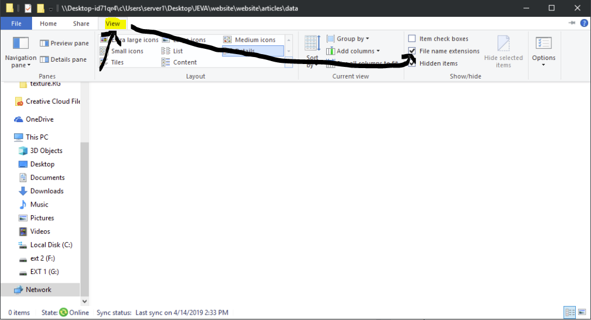
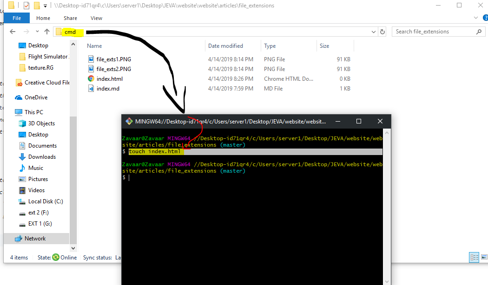

[zua]: https://github.com/thatziv
[logo]: https://raw.githubusercontent.com/jevajs/jeva-screen/master/main.png
# Altering File Extensions.
![logo][logo]

 Written by [Zua][zua]
 > Usually in every scripting video we are required to create files. Each of these files has to have a file type like `.lua, .html, .jpg, etc.` A lot of people seem trouble following the steps in creating a file with a following file type. So let's get right into it.
 
## Method 1 *(easiest way)* - 
 
 1. Go to your folder you want to create the file in.
 2. Click on the `View` tab on the top of the file explorer.
 3. Toggle on the `File Name Extensions` checkbox.
 4. Right click in the folder and go under the `New` menu then click `Text Document`.
    - Now you should have to option to see the file's extension and even change it from `.txt` to whatever you like.
 
## Method 2 -

 1. Go to your folder you want to create the file in.
 2. At the directory tree box, click on it and type in `cmd` and hit enter
 3. In the command prompt, type `touch filename.txt` and change the file name to whatever you like along with the `.txt` also.
 4. Hit enter and your new file should appear. 
 
 